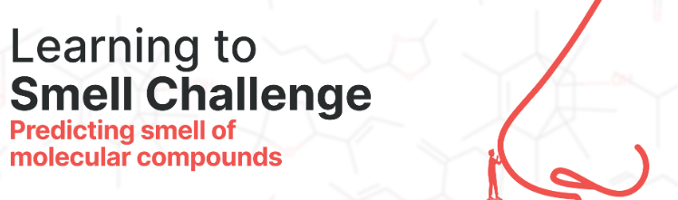
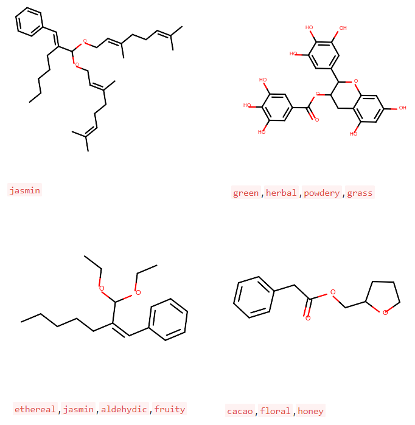

There are so many distinct odors in everything we see or interact with. Our reactions to different smells are almost always instant and instinctual, not cultivated. A particular smell can sometimes trigger a specific memory too. Still, most of us would not know how our brain categorizes different smells from different sensory inputs.

### What happens when particles responsible for smell enter our nose?

Our noses have more than 400 types of olfactory receptors expressed in 1 million+ olfactory sensory neurons, which are all on a small tissue - olfactory epithelium. The olfactory sensory neurons send signals to the olfactory bulb in the brain and then to more structures from there, to understand the smell.

### We are turning this process digital!

In our noses, what finally goes in are particles that have odorant molecules responsible for the smell. These molecules are the actual building blocks of all fragrances. For this challenge, we take these molecular compounds as an input, parse them through, and predict what multitude of fragrances they contain out of 100+ different ones.

## The Dataset

The dataset contains the description of molecules (as its SMILES string), and the odors it possesses. The challenge is a multiclassification problem, each molecule has multiple odors written in a form of a sentence with a single , between each odor. Following are the columns in the dataset with their description:

SMILES: Simplified molecular-input line-entry system (SMILES) is a specification in the form of a line notation for describing the structure of chemical species using short ASCII strings.

SENTENCE (target): Its a combination of the odors of the molecules. Each odor is separated by a , to form an (odor) sentence.

## Approaches

### Method 1
Molecular fingerprints were “a big thing” in chemoinformatics for quite a long time. That’s why there are a lot of different kinds of molecular descriptors (i.e., Morgan, MACCS keys, etc.), and many different methods to obtain them for the given molecules.
In common, any fingerprint is a bit vector that indicates the presence or absence of a particular molecular fragment. There are numerous methods which use them to store molecules in databases or search for similar ones.

I’ve decided to take a look at PubChem (since I’ve found the convenient package PubChemPy to search in this database) and to check if any information about molecules involved in this competition is available there. Surprisingly, most of the molecules were present and had associated precomputed fingerprints. 

I used those to find the k-nearest neighbors for each molecule (k=5, since it is expected to provide 5 predictions for each molecule from a test dataset). For test samples with no fingerprint available, I used the 5 most common scents from the train dataset as “default” prediction.

Accuracy of 38% (Top 20)